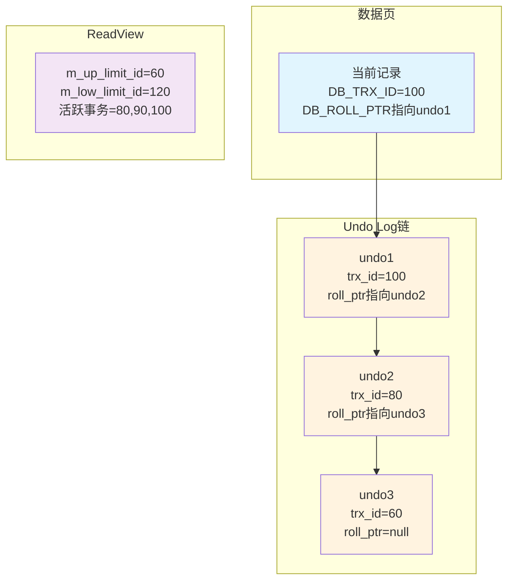
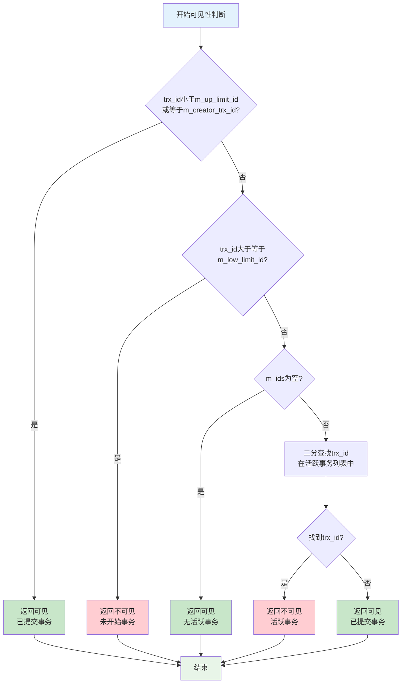
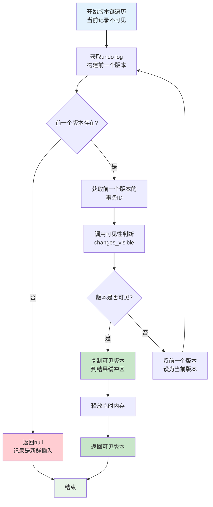
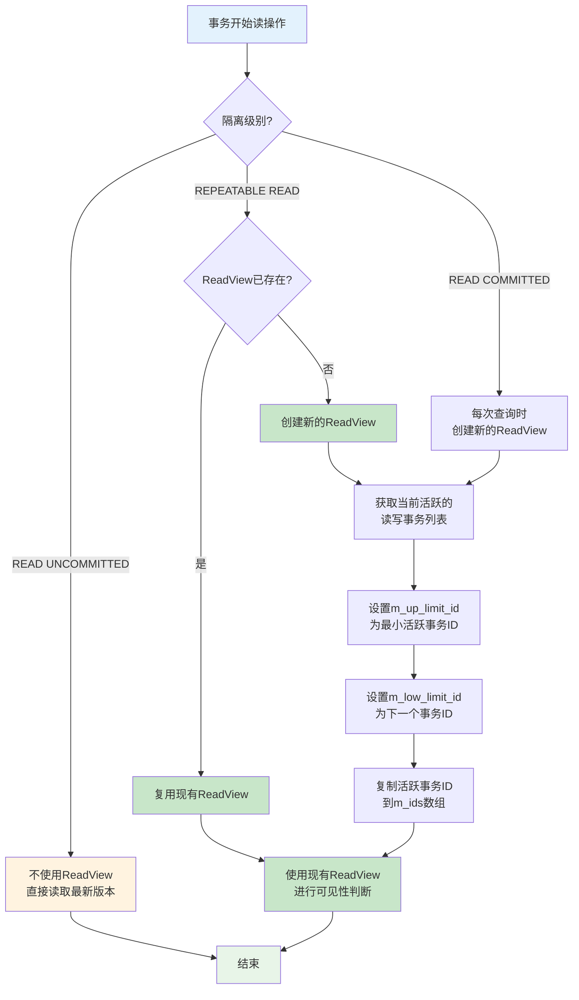
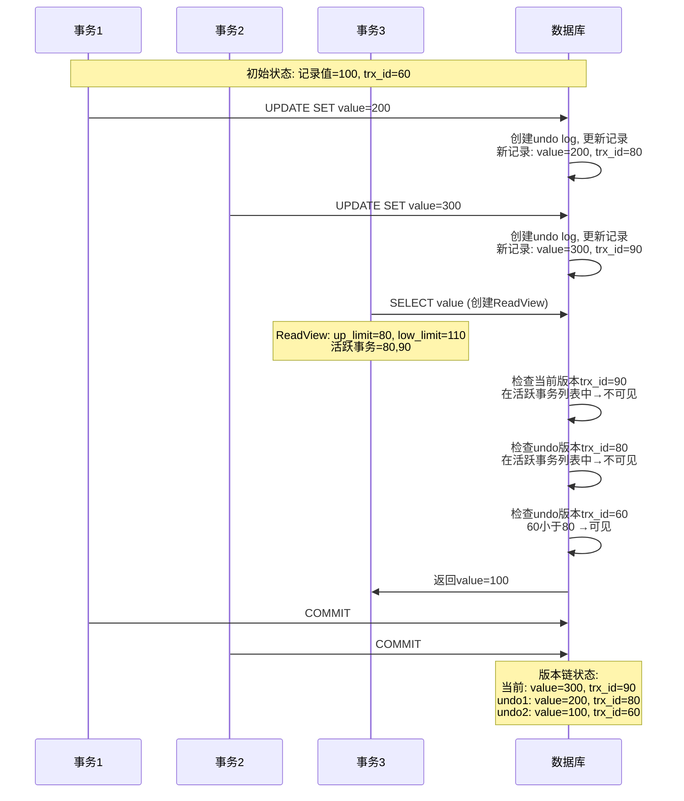
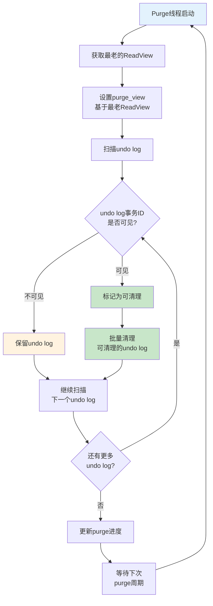

# MySQL InnoDB MVCC机制详解：版本链可见性判断

## 概述

MySQL InnoDB的MVCC（Multi-Version Concurrency Control，多版本并发控制）机制通过维护数据的多个版本来实现事务的隔离性，其中版本链的可见性判断是MVCC的核心机制。

## 版本链结构

### 1. 版本链的组成

InnoDB中的版本链由以下部分组成：

- **当前版本**：数据页中的最新记录
- **历史版本**：通过undo log链接的旧版本
- **事务ID**：每个版本都包含创建该版本的事务ID（DB_TRX_ID）
- **回滚指针**：指向undo log中前一个版本的指针（DB_ROLL_PTR）

### 2. 版本链的构建

```cpp
// 版本链构建的核心函数
dberr_t row_vers_build_for_consistent_read(
    const rec_t *rec, mtr_t *mtr, dict_index_t *index, ulint **offsets,
    ReadView *view, mem_heap_t **offset_heap, mem_heap_t *in_heap,
    rec_t **old_vers, const dtuple_t **vrow, lob::undo_vers_t *lob_undo)
```

## ReadView机制

### 1. ReadView的核心属性

```cpp
class ReadView {
private:
    /** 高水位线：不应该看到trx_id >= 此值的事务 */
    trx_id_t m_low_limit_id;
    
    /** 低水位线：应该看到所有trx_id < 此值的事务 */
    trx_id_t m_up_limit_id;
    
    /** 创建此ReadView的事务ID */
    trx_id_t m_creator_trx_id;
    
    /** 创建ReadView时活跃的读写事务ID列表 */
    ids_t m_ids;
    
    /** 不需要访问undo log的事务号下限 */
    trx_id_t m_low_limit_no;
};
```

### 2. ReadView的创建时机

- **可重复读（REPEATABLE READ）**：事务开始时创建
- **读已提交（READ COMMITTED）**：每次查询时创建
- **读未提交（READ UNCOMMITTED）**：不使用ReadView

## 可见性判断算法

### 1. 核心判断逻辑

```cpp
bool changes_visible(trx_id_t id, const table_name_t &name) const {
    ut_ad(id > 0);
    
    // 情况1：事务ID小于低水位线，或等于创建者事务ID
    if (id < m_up_limit_id || id == m_creator_trx_id) {
        return (true);
    }
    
    check_trx_id_sanity(id, name);
    
    // 情况2：事务ID大于等于高水位线
    if (id >= m_low_limit_id) {
        return (false);
    }
    
    // 情况3：没有活跃事务列表
    else if (m_ids.empty()) {
        return (true);
    }
    
    // 情况4：检查事务ID是否在活跃事务列表中
    const ids_t::value_type *p = m_ids.data();
    return (!std::binary_search(p, p + m_ids.size(), id));
}
```

### 2. 可见性判断的四种情况

#### 情况1：事务ID < m_up_limit_id 或等于创建者事务ID
- **可见**：这些事务在ReadView创建时已经提交
- **原因**：低水位线以下的事务都是已提交的

#### 情况2：事务ID >= m_low_limit_id
- **不可见**：这些事务在ReadView创建时还未开始
- **原因**：高水位线以上的事务都是ReadView创建后开始的

#### 情况3：活跃事务列表为空
- **可见**：没有活跃的读写事务
- **原因**：所有事务都已提交

#### 情况4：事务ID在活跃事务列表中
- **不可见**：这些事务在ReadView创建时正在运行
- **原因**：活跃事务的修改不应该被看到

## 版本链遍历过程

### 1. 遍历算法

```cpp
for (;;) {
    // 1. 获取前一个版本
    bool purge_sees = trx_undo_prev_version_build(rec, mtr, version, index, 
                                                 *offsets, heap, &prev_version, 
                                                 nullptr, vrow, 0, lob_undo);
    
    if (prev_version == nullptr) {
        // 没有更多版本，记录是新鲜插入的
        *old_vers = nullptr;
        break;
    }
    
    // 2. 获取前一个版本的事务ID
    trx_id = row_get_rec_trx_id(prev_version, index, *offsets);
    
    // 3. 检查可见性
    if (view->changes_visible(trx_id, index->table->name)) {
        // 找到可见版本，复制并返回
        buf = static_cast<byte *>(mem_heap_alloc(in_heap, rec_offs_size(*offsets)));
        *old_vers = rec_copy(buf, prev_version, *offsets);
        break;
    }
    
    // 4. 继续遍历下一个版本
    version = prev_version;
}
```

### 2. 遍历过程示例

假设有以下版本链：
```
当前版本: trx_id=100 (不可见)
版本1:    trx_id=80  (不可见)
版本2:    trx_id=60  (可见) ← 返回此版本
版本3:    trx_id=40  (可见)
```

遍历过程：
1. 检查当前版本trx_id=100，不可见
2. 检查版本1 trx_id=80，不可见
3. 检查版本2 trx_id=60，可见，返回此版本

## 实际应用场景

### 1. 一致性读（Consistent Read）

```cpp
// 在row_sel_build_prev_vers函数中
if (!view->changes_visible(rec_trx_id, index->table->name)) {
    // 构建可见版本
    row_vers_build_for_consistent_read(rec, mtr, index, offsets, 
                                      view, offset_heap, heap, 
                                      &old_vers, nullptr, nullptr);
}
```

### 2. 二级索引的可见性检查

```cpp
// 在lock_sec_rec_cons_read_sees函数中
bool lock_sec_rec_cons_read_sees(const rec_t *rec, 
                                const dict_index_t *index, 
                                const ReadView *view) {
    // 二级索引记录本身不包含事务ID，需要检查聚簇索引
    return (true); // 简化处理，实际需要回表检查
}
```

## 性能优化

### 1. 事务ID范围优化

- **低水位线优化**：避免检查已提交的事务
- **高水位线优化**：快速过滤未开始的事务
- **二分查找**：在活跃事务列表中快速定位

### 2. 版本链优化

- **Purge机制**：及时清理不需要的历史版本
- **Undo log重用**：减少版本链长度
- **内存管理**：合理分配和释放版本链内存

## 常见问题与解决方案

### 1. 长版本链问题

**问题**：频繁更新导致版本链过长
**解决**：
- 定期执行purge操作
- 优化事务设计，减少更新频率
- 使用合适的隔离级别

### 2. 可见性判断性能问题

**问题**：大量活跃事务导致判断性能下降
**解决**：
- 减少长事务
- 优化事务提交频率
- 使用合适的ReadView策略

### 3. 内存泄漏问题

**问题**：版本链内存未及时释放
**解决**：
- 确保正确调用mem_heap_free
- 使用RAII模式管理内存
- 定期检查内存使用情况

## 总结

MySQL InnoDB的MVCC版本链可见性判断是一个精心设计的机制，通过ReadView的快照信息和版本链的遍历，实现了高效的事务隔离。理解这个机制对于优化数据库性能和解决并发问题至关重要。

关键要点：
1. **ReadView是可见性判断的核心**，包含事务ID的范围信息
2. **版本链遍历是可见性判断的实现方式**，从当前版本向前查找
3. **四种可见性情况**覆盖了所有可能的事务状态
4. **性能优化**需要在正确性和效率之间找到平衡

## 版本链机制流程图

### 1. MVCC版本链整体架构图

[](https://mermaid-live.nodejs.cn/edit#pako:eNqFk99q2zAUxl_FnN26mW3FaSLWQm33YpCxEbIxFhfjznJikC2jSrRdyNUuxv4UNkofoC9QerEx2OieZg7tW0yxm0ZhK9OVzvn8O5_OkTWF1ywhgGHM43JiDL2wMNQ6kPtNIoT52eX85OLm_FsIjbZYO6Pq6rR6f3J9cVldnT3a5w-3Ay8aDl5Gj4Mt27KWmcHTfj96NhzMP72rPn-RRcLsvaYKKZJm85fhc_WV0Wfjm9NfuqU3qvG6suBHUZbcGXFGaVQKvnJx9lagX4OODnbv45DGBTWHdK6zzm0VktL_9jMgcfIiI4d6M7ujPJJlRLM8E1rhPKLscJW1nSY9__rz-vvb3z8-Vh_O1dnNnmWq1v9tvGNsbGwbt9fo1YHfBH4dBGunFMeUKCTNKMUPiJ26KdGV3VslRcRNXV3xlkqqNEtX_HuVYE0BU_1zWQJYcElMyAnP40UI0wUTgpiQnISA1TYhaSypWAxwprAyLl4xli9JzuR4AjiN6YGKZJnEggRZrMaf32W5mhLhPpOFAGxbdQ3AUzgC7Lh2q211kIsctdouMuEYMOq13I7T3ux17J5jIdSdmfCmNrVa3U3XBJJkgvEnzeOp39DsD3L1Exc)


### 2. 可见性判断流程图


[](https://mermaid-live.nodejs.cn/edit#pako:eNqNVG9r00Ac_irhfNvVNmm6Nshk67-1ne98ZVtKTC5tIGnKNcHNtDARpHNqB8omOJ2DaqdQNkRYyUS_TC7txzDNtUvCHHgvjjy_h-d5fr87ciYQNBECDkiK9kRo8kinHmarLcpd6xX8axeP9vHgfDZ65uyOcH_oHI5r1MrKGrVh6mi7Lov4YmBbb9S60a4rsirrbuneY3R3zekfTsd7HiUgyOsaqhPB_R5xJ_vG3KzrvD_vUpnK7M87_OETifNM8OUPZ3BgW0Pb2scvT2tBDT742qWyyy6GIzdqGehOct1MOC7rx-UWcfbkdSDROf5Ohg4lZv3EvKm6rh17Yk2_WWHzvG9euDmLc_TZ-Xk1u3wecs77zpsV23qF-y-cky_O3m8yFzmF47OgEvePZqdn9mRcC4ZverdSNF0p7l-Ej7roN1b699Q3Gyv6jZX_92LInvE62apMr946H08WVI4UCSgEQSkIykFA9o6-o0BqnZJkReHuQEaiJTHIbC2ZlMTCVJDJLBghBZNCOsjkFowkCaJIB5nCrZrSrZpySAMioIFkEXA6MmAEqBCp_BwCc66pAr0JVVgFnPspQok3FL0Kqq2eK2vzrUeapi6VSDMaTcBJvNJxkdEWeR1mZb6BePW6imBLhCijGS0dcHHa8wCcCbYBR7PxaCKWZFiGdleCZSJgB3BMOsom6cRqOhlP0zGGSfUi4KkXGoumVtkIgKLs_qsPyJvgPQ29v86nptU)



### 3. 版本链遍历流程图

[](https://mermaid-live.nodejs.cn/edit#pako:eNptU29v0kAc_irN-ZYhUMqgMTMb3QZjvvOVhZiOXoGktEtp1QkkLG7INhlGEBdFjMmUxThHFjMJ--OX4Qp8C8td0Y54Ly73u-d57nnud7k8SKoiBCyQZPVpMi1oOvWQiyuUNRZ5dFVCnYPhXsVsfR_Xb8bbVXRYvreh3V1A13W0Vx396KLrt4NeFdXORp3tBDU3t0At8aPDX6jWNBRRpWQ1hflmewdd9i3JoFca9L6RIxPEh8xLWBzOz3DQ6RFqndwvElJ4Qiqg118LFMePfjfQh7ZiyDK2IGHMozOz2R2ft8zaG7T7JeHUWViBWrbjzfgM3-_gUwb9A7T_OcrdyraMs63wo-6LYeOEXNYsdVDl2GyeYpnVOSUFc4-fZHKZDRna6hWsW80TC8veSk7U0wuRefVfvAiPjquockFoREg6XukOL-tmuzW8qqPyOXrVTzjFuCdRHnXLMxeze3Mz6PXJo_2n91HycKSI4GKNH7_cNxuW7Kf57gKVd62HsDVrmBCz--8MahM4TFjnJ3k_frI3Y2TTaZvTt2RILVJSRpbZO5CWfJLoRNanSFBiYNCJcDYiSUlR9DmRiI0kgzCQDDmR2C0EuEBKy4iA1TUDukAWallhUoL8RBMHehpmYRyw1lKEkmDIehzElaIl2xSUR6qanSo11UilASsJcs6qjE1R0CGXEVKakP27q0FFhFpYNRQdsN4APgOwefAMsD7G6_Z7AjRD-6zhZ2gX2AIsHXIzAZ9_PhTwhnwemg4WXeA5NvW4g_OMC0Axo6vaA_J18Q8u_gHM7pi4)


### 4. ReadView创建和更新流程图

[](https://mermaid-live.nodejs.cn/edit#pako:eNp9lO9P2kAYx_-V5vYWHVJBaBYXpKgobIthe7FiTEev2qSlppY4ByQsMwvOKUt06pTFsDg1mwpZjBKY85_pXfG_2PUHBjRbX1z63Pf5fp48z10uB9KqAAEDRFldTM_xmk4l2VSGIl-YM5qr6EMV_S6io9V2rYU31oyryjTV1zdMjeRudjfNw5bZPEKln48LjsVZR6yM_FQ0zFLPn0SeJhKxZDLK5qkIZzQI4drcPJ6CvPBCgouPXmkPh829c7z-nRRA5S1cKeKturlSwpWT6Xu4LhjL4VoZn1TxPnF-w9sXNgqV9lCraRF2lzs17mCeRcPJ8Eg8SlnEPBXNdfLQ5S90uoMqx73dRG0f-nSYp0a5__CdPLxTy1NjHDpYI12a63VcWbmT56yj9hTHufb6JekaXW2glTV83mpfviNkuxVrHu-_uEdQ2m5Xj13AuG2Nce2zP-bVmTKTnZ-RJUXSZyTBNhqNJpkiqpcdnkOIsa47Zrsnbt3k2O_Zjcaq0SgajR93vBO2d9LqDpUuevHu-OsK4Szgz3WztdzTMOs07ARjdhDnnMvQOyan-eu9dvUjKtfaR29xkVyxA7x16vImHbMTROwgwZmtDfx1382IO5vd5Rf0JRlSYUqUZJl5AGnRJwrdSqKjBEU_DHYrEVcRRZGG3m5l1FXSQRhIh7qVsX8q8R4FeMCsJgmA0bUs9AAFagpvhSBneVJAn4MKTAGG_ApQ5LOyngKpTIHY5vnMS1VVOk5Nzc7OAUbk5QUSZecFXoesxM9qvHK7q8GMALWIms3ogPHbCMDkwGvA-PwD_YPeAO2nfeQb9NMesAQYOtTvD_gGh0KBgZDPS9PBgge8sWt6-4NDBAAFSVe1hPN-2M9I4S9he7wF)



### 5. 并发事务版本链示例

[](https://mermaid-live.nodejs.cn/edit#pako:eNqtVE1v00AQ_SurPYFkgu1N3GRFIpGPAxIBRAMHFKky8Ta1FNthY_eDKFIqJJS2CpUIhUMKqEKoPUDJoYIqpfBfUNYN_wI7dpykMbfuwfLsm31vZnZ26rBkKARiWCPPLKKXSFaVy1TWijpwVlWmplpSq7JugoIA5BoY9HfY9oEQAosTWAyB0QRG83A27cL2Xs9uH7N-x3PwvvcMkwBjlVAnAi6bxoC13rPDnYvt73ZzE4PhcY-d77Hmz6TA8xww6fqSqiQlfpqiINxIpdyjjx5kbxdyYDFXAKtyxSJJkfcds2nfhbW67Kxv6YoBKkaZA3b3xH7b81RuPaU3U4GFJxyBbnxWV_yfLroCXTSlm5jVRT7pYu5uLuNrgmuexEMiK49VsnZ9rrwIgzGIgVVdqqiaajopcU5Ea74lCLwXzcnZ8McL7z5dl9kAgqzsT03742d23mFb7Yutlr3_JQh4RMP2j6aZWOvd8OBocPr1z8vXg9M22_02PNwMpXQLNUMYv2pCySOUeNbbHfRfxXngcMwRuEUb_n7Duh-8SxH48M7L3M_n7xQutcX05uXbcHEvnr-dX36zexmOihneBCMHNxMhvDkDXBzjs48GcrBMVQVik1qEgxqhmuyasO6GV4TmCtFIEWLnVyHLslUxi7CoN5xjzit-Yhja-CQ1rPIKxMtypeZYVlWRzfFkCXYp0RVCM4almxCLwogD4jpcd6yYEInyEooh0VnRGOLgBsQoEYlJYnQhIQkJkUco3uDg85EoH4kvxDhIFNU0aN4baKO51vgHfiHgiQ)


### 6. 版本链清理(Purge)流程图
[](https://mermaid-live.nodejs.cn/edit#pako:eNptk99v0lAUx_-V5vrKkFFg0JgZxu9tJsYYHyzEVHoLJKUlXes2CwlLnAsjDnxwmRtmLjEbUQd7MLF2cfwz7W39L7zcwlIX78NNz_2ez_ecc5urg7LMQ8AAQZQ3y1VOUamn6aJE4ZVkH2tKBTrmxBl27f7Y3h-WqIWFZWqFdQ9-2r1DNGi77R3n-M0TyPHPanCz5IErJCvFuqMb5_eoMTV58QrLD14q95ftU9MyDzz0DuftKUKnWdT5hno9TeJlSpQrXuWMPo8ts2vvnxXSxBMdje3-ud0buxc7D1t-s8wUa3pKk8qy6POeO7qyDBMfIWPX6b8t-RMt4908N8dak0_Oh4-3Dfhts6SbPO7x15-9nmfkTTe3xbdyh8wRpsA61xfO9aU3HWEso2sZbcv4-t9SeQ_zggIJVnV3coQGHXTyw_5yTDzm6Hz6VTIOvpcmlfGf4GtqUmssJtHhFfkz7uTENs9nJdeI_zrrXHbsm13cGPp-RvxJqv1-iAans9R1kpr0t7qhbouQSlJCTRSZe5AWwgLvV7IzpRyHsXLCr-RmiiAINAz5lfw_DAiAilLjAaMqGgyAOlTq3DQE-pQpArUK67AIGPzJQ4HTRLUIilILYw1Oei7LdcAInLiBUUXWKtXbSGvwnArTNa6icL4cKPFQScmapAImHCUmgNHB1jRaDEZCMTpKh_GKROkA2AYMnQhGY-HIUiK2mAiHaDreCoDXpGooGF_CBpCvqbLyyHtx5OG1_gL681sF)



## 版本链遍历过程
