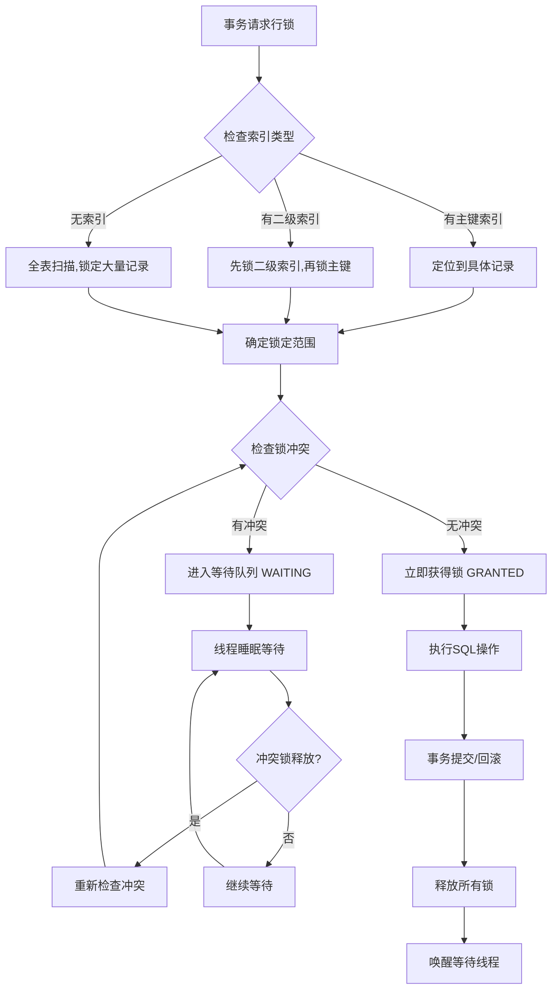
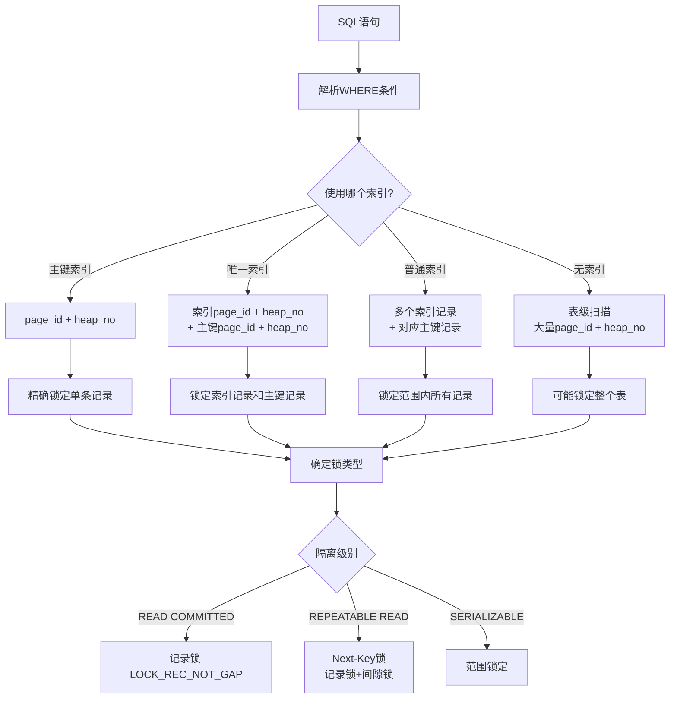
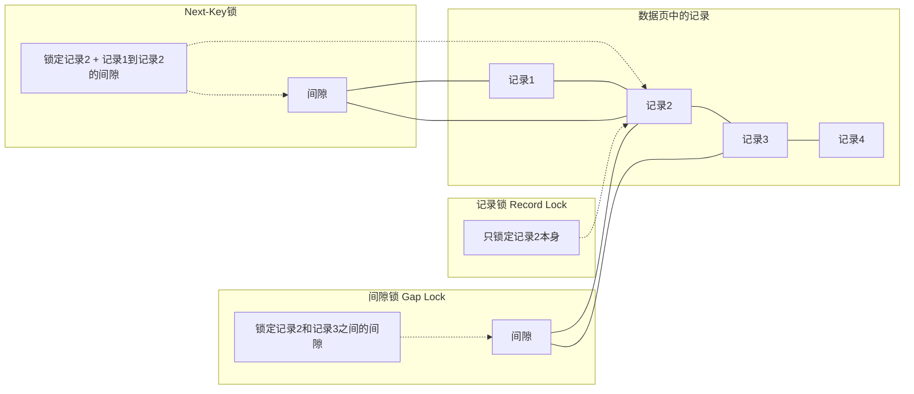
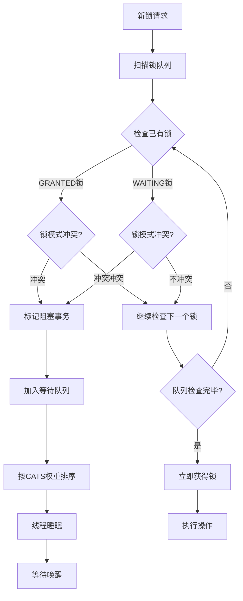
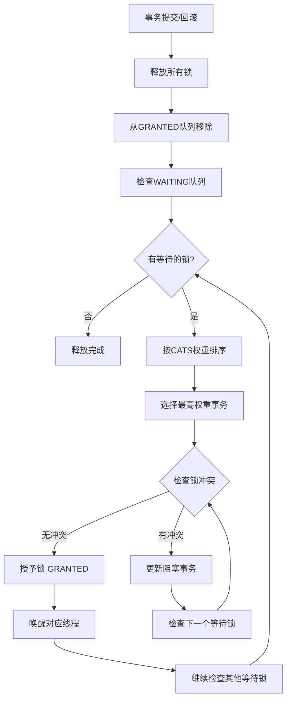
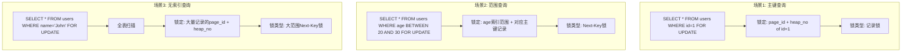

# MySQL锁机制流程图详解

## 1. 行锁请求处理流程

## 2. 锁定对象识别流程

## 3. 三种行锁类型示意图

## 4. 锁冲突检测流程

## 5. 锁释放和唤醒流程

## 6. 实际应用场景示例

## 7. 行锁核心概念总结

### 行锁锁定的对象
- **page_id**: 数据页标识符
- **heap_no**: 记录在页面内的位置编号
- **不是直接锁定行数据本身**，而是锁定记录的位置信息

### 三种锁类型
1. **记录锁 (Record Lock)**: 只锁定具体记录
2. **间隙锁 (Gap Lock)**: 锁定记录之间的间隙
3. **Next-Key锁**: 记录锁 + 间隙锁的组合

### 锁的生命周期
1. **请求阶段**: 事务发起锁请求
2. **等待阶段**: 遇到冲突时进入等待
3. **获得阶段**: 冲突解除后获得锁
4. **释放阶段**: 事务结束时释放锁

### 性能优化要点
- 使用合适的索引减少锁定范围
- 避免长事务减少锁持有时间
- 合理设置隔离级别平衡一致性和性能
- 理解不同SQL语句的锁定行为